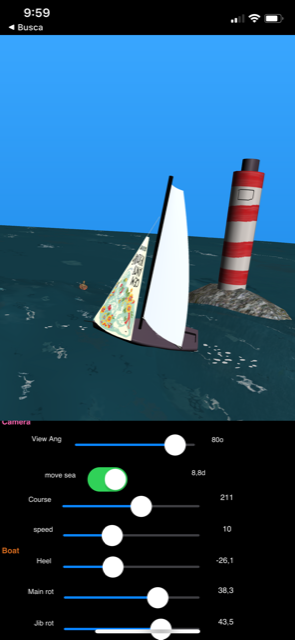
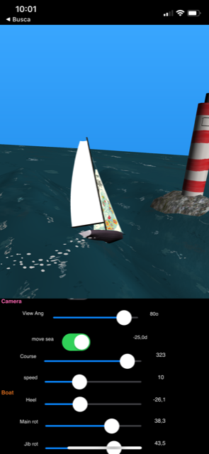

# SailboatDemo

App video on Youtube

#Delphi #Firemonkey 3D app for Windows, iOS and Android.

This app features a 3D scene with a rigged sailboat over animated ocean surface.  

This GBE3D demo application was added to this fork of GBE3D 3d components, by Gregory Bersegeay. 

    https://github.com/gbegreg/GBE3D   ( visit and give it a star ! )

SailboatDemo was expanded from *waterdemo* sample. 
The SailboatDemo rigged boat scene can be used in sailing games and simulations.

Features:
* Multi platform ( Windows, iOS and Android using Firemonkey 3D ).
* Original 3d models built with Blender (boat, ship, dolphin, whale). See */models* 
* Main and bow sails with curved surfaces. Configurable and dynamic sail mesh: object TSailSurface.
* animated Wind Arrow: object TWindArrow. 
* Ocean surface animated with waves and moving texture. object TOceanSurface. 
* Boat and ocean surface fixed to the 3D world center 0,0 (boatcentric universe).   
* Boat floats on waves and pitches to match wave inclination.
* Objects parented to OceanSurface float on it and are moved with boatspeed (ex: boat wake bubbles, ship, land... ). 
* A system of TDummys allows setting boat's *course*, *heel* and *pitch* independently, avoiding gymbal locks ( Never change all 3 dimensions (x,y,z) of a 3D Object.RotationAngle ). See hierarchy image below.
* Rock with lighthouse (but no collision detection). Terrain and rocks don't float but are moved by the OceanSurface.
* Animated wild life: dolphin, whale, pelycan. 
* A set of marks is available for regatta gates.
* Clouds in the sky ( TGBEClouds )
* Cardinal points indicated on the horizon ( "N", "S", "E", "W" )
* As the boat moves, it leaves a wake of floating bubbles (circles). Bubbles are recycled over time.  
* The main rectangle of sea surface (30x30) is surrounded by 4 other, less detailled, ocean surface rectangles.  
* Large textured TDisk underneath represents the sea horizon.
* Large scale *terrain* object (land) can be set with a grayscale bitmap ( a TGBEHeightmap ). 
* Scrollable listbox contains all app controls: camera, boat, waves and object groups ( click button at top-left to toggle controls) 
* Main camera controls: AngleOfView, Azimuth and elevation. 
* Option to design camera. Note that design camera cannot be zoomed or moved ( may look unresponsive )
* Mouse actions: vertical drag changes elevation, horizontal drag rotates camera.
* Boat controls: toggle movement, Course (or Cap), Speed, Heel, jib and mainsail rotation.
* Wave system is a sum of 5 senoid waves w/ configurable Amplitude, Longueur, Vitesse and Origine ( same as TGBEPlaneExtend, Om: kept the french names ) 
* object TWaveSystem
* All graphic assets (3d models and textures) are embedded in the form file (fSailboatDemo.fmx). That is why the .fmx is so big (25M). 
 
Note: At this time *Github Web* does not accept files larger than 25MB to be posted. Had to use git command line to update *fSailboatDemo.fmx*.

## Viewport3D object hierarchy

SailboatDemo 3d machinery: Every 3d object is parented to a TDummy (see image below). The dummys are used to position objects at run time. The position of actual objects is set at design time, in relation to its dummy. This allows fine adjustment of object positions. 

Also helps with objects doing cyclic movements. As an example, dummyDolphin is parented to the OceanSurface, so it floats. The Dolphin model itself is moved up and down (Position.z) with a senoid function to jump out of the ocean.

## Not included

Not implemented at this time:

* no 3D Collision detection ( ship, rock ..)
* no Wind driven boat ( boat just moves at a speed set in the Speed tabcontrol ). One could add a boat wind x speed chart ( polars ) to calculate boat speed.
* no Terrain updates as the boat moves.

## Compiling SailboatDemo

In order to compile this demo you have to install GBE3D components:

* install the *GBE3D* design package *in this fork* as I have added 3 mesh components: TOceanSurface, TSailSurface and TWindArrow. 
SailboatDemo also uses TGBEHeightmap for the terrain and TGBEClouds. 

* Status: Tested with Delphi 11.1 on Windows, iOS and Android (jun/22)

## Rigged boat

Form in fSailboatDemo.pas is rigged to be controlled externally.  
These functions allow manipulating the state of the boat for the frame at run time:

    procedure SetBoatState(const aCap,aHeel,aSpeed,aBoomAngle,aRudderAngle,aWindDir,aWindSpeed:Single);  // sets state of boat 
    procedure SetSailShape( ixSail:integer; aPtArray:TPointF_Array );                                    // sets sail surf to a polyline
    procedure set3DcharacterState(ix:integer; const x,y,alfa:Single);   // ix = which char               // sets position/rotation of animated character
    procedure set3dMarks(ix:integer; const ax,ay:Single);                                                // sets mark position 
    
    Procedure setTerrainBitmap(bVisible:boolean; aBMP:TBitmap);  // use a gray shade bitmap to set large scale terrain ( land )     
    
## 3D models and textures    

All models used in SailboatDemo are embedded in fSailboatDemo.fmx file. 
Model and texture files are not needed to build or deploy the app.

But they are available for edition in Blender .blend format  (original) and in .glb

See *models* folder.

https://github.com/omarreis/GBE3D/tree/master/demos/SailboatDemo/models

To import modified 3d models into the scene, I used Blender to export models to collada format ( one that works with TModel3D ) and then imported the TModel3D in the Delphi IDE.  

## Windows executable

The executable with all graphic assets inside makes it easier to run the app. 
A single file - *SailboatDemo.exe* - is needed. No instalation required.

Single file Win32 executable (v2.0):
*  https://github.com/omarreis/GBE3D/releases/tag/V20

## Privacy

This demo doesn't save data to files, uses no cookies and collects no user data.
Session state is not persistent.

## iOS/Android

App is not available in the phone stores at this time, but runs ok on iOS and Android.
To run on these devices, you must compile from source.

## OPYC game

You can also experiment with this code on phones by using *OPYC* sailing game. OPYC combines this 3D scene with 2D animation using Box2D physics engine, integrating real world NOAA winds and high resolution world maps GSHHG. 

OPYC is available on app stores (iOS and Android). Search for "OPYC". 

* OPYC home / Windows download: https://www.tecepe.com.br/nav/opyc

*OPYC game requires user registration* 

## Videos

* https://youtu.be/M9_Z5RxW3Pc   SailboatDemo V2 on Youtube (jun22) - new!

* https://www.tiktok.com/@omar_reis/video/7107767340376329478 tiktok of SailboatDemo on phone  new!

* http://www.youtube.com/watch?v=bBpZxB8GLpg   SailboatDemo V1 on Youtube

 

