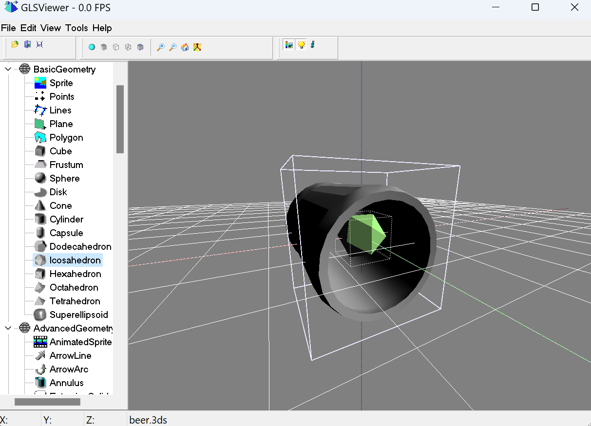
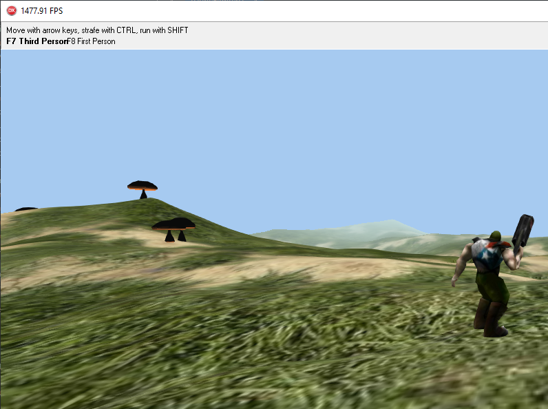
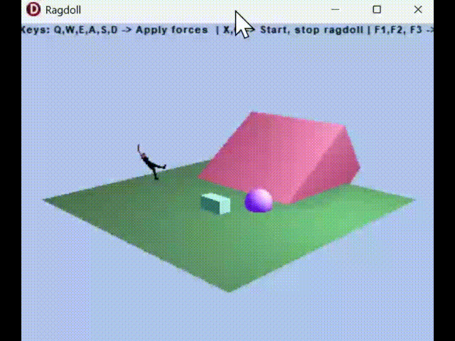
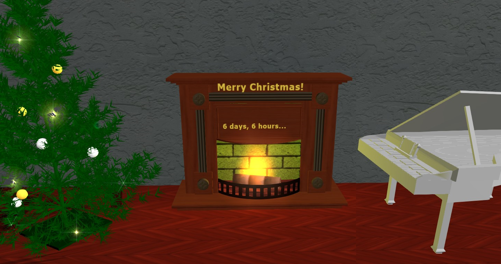
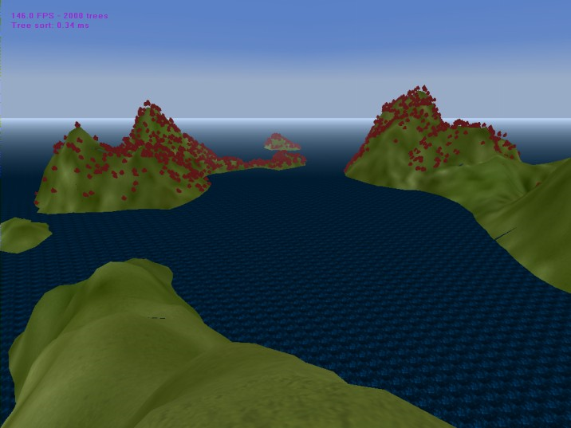
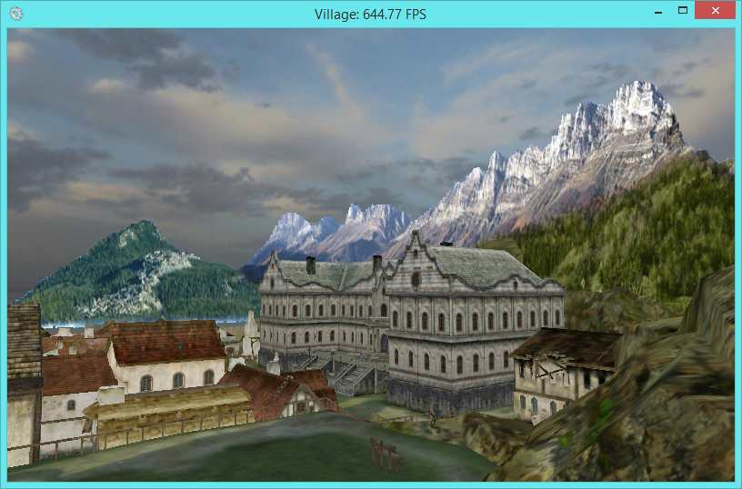
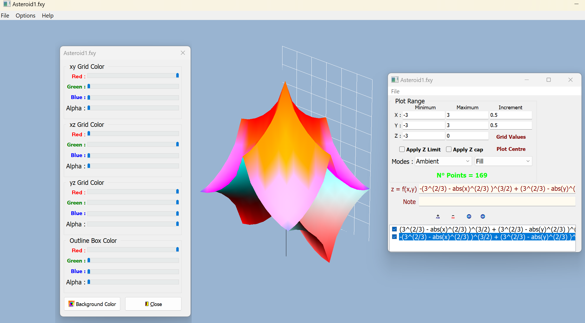

# GLXEngine
GLXEngine - a graphics engine collector with GLScene & GXScene component packages for Delphi & C++ programming.
Class libraries for creating 3D scenes with rendering and animations of spatial objects 
include managers for supporting physics, sounds, terrains with materials and shaders. 
### How to install
1. Download a zip archive of the last release or clone the repository
2. Run _setupDLL_admin.cmd to support external dynamic libraries
3. Configure the IDE settings and paths to source and sourcex
4. Open GLScene & GXScene group projects, compile and install components
5. Run Examples for C++Builder or Delphi   

Some examples: 
GLS Viewer

Dune Fighter

Clothify 

Christmas

Forest

Village

Plot2D

GLXEngine Team
